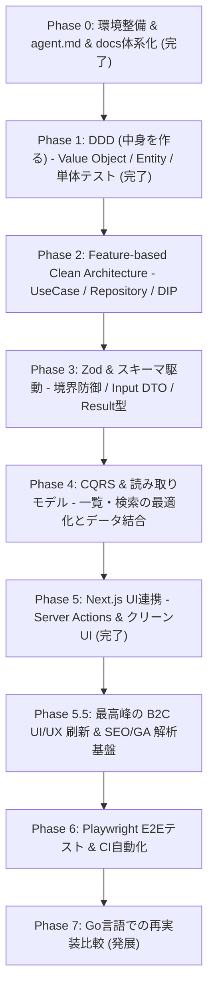

# 学習ロードマップ (Learning Roadmap)

本書は、「AI × note アイディア販売所（AI-Note Market）」の開発を通じて設計思想を段階的に学ぶための全体ロードマップです。

---

## 各フェーズの詳細ゴール

### Phase 0: 環境整備 & AI制御 (完了)
- [x] ワークスペース準備 (`ai-note-market`)
- [x] Antigravity AI行動制御ルール (`.agents/rules/`)
- [x] ドキュメント階層構造 (`docs/`)
- [x] TypeScript / Vitest / Biome / Husky の基本環境セットアップ
- [x] GitHub Actions (CI) と Vercel (CD) の自動化パイプライン構築
- [x] Git管理・GitHub連携・PRテンプレート整備・レビューSkill配備

### Phase 1: 【ステップ1】DDD（中身を作る） (完了)
- **ゴール**: 外部フレームワークに一切依存しない純粋なドメイン層を実装し、ビジネスルールを強固にカプセル化する。
- **実装内容**:
  - [x] 共通基盤: `Result` 型, `DomainError` 基底クラス, `ValueObject` / `Entity` 基底クラス
  - [x] `UserId` & `NoteId` & `PurchaseId`（識別子）＋ 単体テスト (15 passed)
  - [x] `Price` Value Object（無料0円、有料100円〜100,000円、Flyweight最適化）＋ 単体テスト (11 passed)
  - [x] `NoteTitle` Value Object（5〜100文字、トリム処理）＋ 単体テスト (9 passed)
  - [x] `Category` Value Object（大カテゴリ×小カテゴリの整合性、Flyweight最適化）＋ 単体テスト (10 passed)
  - [x] `NoteContent` Value Object（本文：無料10〜10,000文字 / 有料1〜50,000文字）＋ 単体テスト (15 passed)
  - [x] `Note` Entity / Aggregate（状態遷移：Draft → Published → Archived、閲覧認可）＋ 単体テスト (15 passed)
  - [x] `Purchase` Entity / Aggregate（自己購入禁止、販売状態検証、価格スナップショット）＋ 単体テスト (6 passed)
- **テスト**: Vitest による純粋なドメイン単体テスト (全85件 All Green, 32ms)

### Phase 2: 【ステップ2】Feature-based Clean Architecture（器で包む） (完了)
- **ゴール**: 各フィーチャー内でドメインを呼び出す手順（UseCase）と永続化の約束事（Repository）を定義し、依存性の逆転（DIP）を体感する。
- **実装内容**:
  - **記事機能 (`src/features/note/`)**:
    - [x] `INoteRepository`（インターフェース）
    - [x] `PublishNoteUseCase`（記事公開ユースケース）
    - [x] `InMemoryNoteRepository`（テスト用インフラ具象）
    - [x] ユースケース単体テスト
  - **購入機能 (`src/features/purchase/`)**:
    - [x] `IPurchaseRepository`（インターフェース）
    - [x] `PurchaseNoteUseCase`（記事購入ユースケース：二重購入防止・自己購入禁止・保存）
    - [x] `InMemoryPurchaseRepository`（テスト用インフラ具象）
    - [x] ユースケース単体テスト
- **テスト**: インメモリリポジトリを用いた高速なユースケース単体テスト (全18件 All Green)

### Phase 3: Zod によるスキーマ駆動・境界防御 (完了)
- **ゴール**: ドメインルールと外部入力バリデーションの責務を綺麗に分離する。
- **実装内容**:
  - [x] APIやフォームからの入力を検証する Zod スキーマ（`createDraftNoteSchema`, `publishNoteSchema`, `purchaseNoteSchema`）
  - [x] DTO からドメインオブジェクトへの変換と Result 型によるエラーハンドリング（`validateSchema`, `SchemaValidationError`）
  - [x] ADR 0007 起票（`schemas/` 独立配置と境界防御方針）
- **テスト**: スキーマ検証および異常系門前払いの単体テスト (全18件 All Green)

### Phase 4: CQRS による読み取り専用クエリモデルの構築 (完了)
- **ゴール**: 疎結合にした集約同士の一覧表示（購入履歴、著者別記事一覧等）を、集約を介さず高速に結合取得するクエリサービスを構築する。
- **実装内容**:
  - [x] `PurchaseHistoryQueryService`（マイページ用購入一覧 DTO 取得）
  - [x] `NoteSummaryQueryService`（一覧画面用カード DTO 取得）

### Phase 5: Next.js App Router UI 実装 & Vercel デプロイ
- **ゴール**: Clean Architecture の最外層（Presentation層）として Next.js を接続し、Vercel 上で動作確認を行う（ADR 0002 参照）。
- **実装内容**:
  - 記事一覧・詳細画面（Server Components）
  - 購入ボタンと Server Actions による UseCase 呼び出し
  - 閲覧権限（購入済みか否か）による本文表示制御
  - Vercel への初回デプロイとプレビュー環境の確認

### Phase 5.5: 最高峰の B2C UI/UX 刷新 & SEO/GA 解析基盤
- **ゴール**: 既存のメディアプラットフォーム（note等）を凌駕する極上の読書体験（UI/UX）と、商用レベルの SEO 対策・アクセス解析（Google Analytics）基盤を構築する。
- **実装内容**:
  - 【UI/UX】ダッシュボード型の画面枠を全廃し、B2C特化の「ミニマルなトップナビゲーション ＋ 余白を生かしたシングルカラム」へ刷新。
  - 【UI/UX】読者の没入感を高める緻密なタイポグラフィ（フォントサイズ、行間、文字色、コントラスト）の再設計。
  - 【SEO】Next.js Metadata API を活用した動的タイトル・OGP画像生成、および `sitemap.xml` の自動生成。
  - 【SEO】検索エンジン向けの JSON-LD (Article スキーマ) 構造化データの埋め込み。
  - 【Analytics】Google Analytics (GA4) の Next.js (App Router) への最適化された組み込みとイベント計測。

### Phase 6: Playwright による E2E テスト & CI ワークフロー
- **ゴール**: ユーザー視点でのシナリオテスト（執筆 → 公開 → 別ユーザーで購入 → 閲覧可能になる）を自動化し、GitHub Actions で継続的テスト環境を構築する。
- **実装内容**:
  - 主要ユースケースの E2E シナリオテスト実装
  - `.github/workflows/ci.yml` による push/PR 時の自動単体テスト・型チェック・E2E実行ワークフロー構築

### Phase 7 (発展): Go言語によるバックエンド分離と GraphQL 基盤構築
- **ゴール**: 現在のNext.jsフルスタック構成からドメインロジックを切り離し、将来のスマホアプリ（React Native等）マルチクライアント展開に耐えうる独立したAPI基盤を構築する。
- **実装内容**:
  - 【Backend】Go言語によるドメイン駆動設計（DDD）の再実装。
  - 【API】GraphQLサーバーの構築（スキーマ駆動開発による型安全な通信）。
  - 【Frontend】Next.js から Server Actions を廃止し、Apollo等を用いたピュアな GraphQL クライアントへと作り直す（Headless化）。
  - 言語特性（TypeScriptのクラス指向 vs Goの構造体・インターフェース指向）によるアーキテクチャ表現の違いを比較・学習。