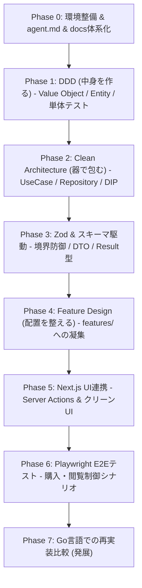

# 学習ロードマップ (Learning Roadmap)

本書は、「AI × note アイディア販売所（AI-Note Market）」の開発を通じて設計思想を段階的に学ぶための全体ロードマップです。

---

## 各フェーズの詳細ゴール

### Phase 0: 環境整備 & AI制御 (完了)
- [x] ワークスペース準備 (`ai-note-market`)
- [x] AI行動制御ルール (`agent.md`)
- [x] ドキュメント階層構造 (`docs/`)
- [x] TypeScript / Vitest の基本環境セットアップ
- [x] Git管理・GitHub連携・PRテンプレート整備

### Phase 1: 【ステップ1】DDD（中身を作る） (進行中: Step 02 準備中)
- **ゴール**: 外部フレームワークに一切依存しない純粋なドメイン層を実装し、ビジネスルールを強固にカプセル化する。
- **実装内容**:
  - [x] 共通基盤: `Result` 型, `DomainError` 基底クラス
  - [x] `Price` Value Object（無料0円、有料100円〜100,000円、Flyweight最適化）＋ 単体テスト (11 passed)
  - [x] `NoteTitle` Value Object（5〜100文字、トリム処理）＋ 単体テスト (9 passed)
  - [x] `Category` Value Object（大カテゴリ×小カテゴリの整合性、Flyweight最適化）＋ 単体テスト (13 passed)
  - [ ] `NoteContent` Value Object（本文：無料/有料エリア）
  - [ ] `Note` Entity / Aggregate（状態遷移：Draft → Published → Archived）
  - [ ] `Purchase` Entity（購入者、決済金額、購入日時）
- **テスト**: Vitest による純粋なドメイン単体テスト

### Phase 2: 【ステップ2】Clean Architecture（器で包む）
- **ゴール**: ドメインを呼び出す手順（UseCase）と永続化の約束事（Repository）を定義し、依存性の逆転（DIP）を体感する。
- **実装内容**:
  - `PublishNoteUseCase`（記事公開）
  - `PurchaseNoteUseCase`（記事購入、二重購入チェック、著者本人購入禁止）
  - `INoteRepository` / `IPurchaseRepository`（インターフェース）
  - `InMemoryNoteRepository` / `InMemoryPurchaseRepository`（具象）
- **テスト**: モックやインメモリリポジトリを用いたユースケーステスト

### Phase 3: Zod によるスキーマ駆動・境界防御
- **ゴール**: ドメインルールと外部入力バリデーションの責務を綺麗に分離する。
- **実装内容**:
  - APIやフォームからの入力を検証する Zod スキーマ
  - DTO からドメインオブジェクトへの変換と Result 型によるエラーハンドリング

### Phase 4: 【ステップ3】Feature Design（配置を整える）
- **ゴール**: 肥大化に耐えうるディレクトリ構成（Feature-based Architecture）へ整理する。
- **実装内容**:
  - `src/features/note/`
  - `src/features/purchase/`
  - `src/shared/`

### Phase 5: Next.js App Router UI 実装 & Vercel デプロイ
- **ゴール**: Clean Architecture の外側（Presentation層）として Next.js を接続し、Vercel 上で動作確認を行う（ADR 0002 参照）。
- **実装内容**:
  - 記事一覧・詳細画面（Server Components）
  - 購入ボタンと Server Actions による UseCase 呼び出し
  - 閲覧権限（購入済みか否か）による本文表示制御
  - Vercel への初回デプロイとプレビュー環境の確認

### Phase 6: Playwright による E2E テスト & CI ワークフロー
- **ゴール**: ユーザー視点でのシナリオテスト（執筆 → 公開 → 別ユーザーで購入 → 閲覧可能になる）を自動化し、GitHub Actions で継続的テスト環境を構築する。
- **実装内容**:
  - 主要ユースケースの E2E シナリオテスト実装
  - `.github/workflows/ci.yml` による push/PR 時の自動単体テスト・型チェック・E2E実行ワークフロー構築

### Phase 7 (発展): Go言語での再実装・設計比較
- **ゴール**: 同じドメインルールを Go のインターフェースと構造体で実装し、言語特性による表現の違いを比較。
