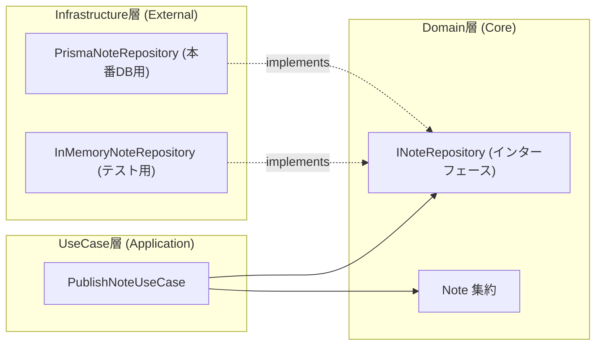

# Feature-based Clean Architecture 設計思想 (Clean Architecture & Feature Design)

- **カテゴリ**: アーキテクチャ理論 (`docs/01-architecture/`)
- **テーマ**: DDD（中身）× Clean Architecture（器）× Feature Design（配置）の三位一体構造と依存性の逆転（DIP）

---

## 1. 三位一体のアーキテクチャ全体像

本プロジェクトでは、大規模開発における高い保守性と変更の局所化（コロケーション）を実現するため、以下の3つの設計思想を融合させています。

```text
┌─────────────────────────────────────────────────────────────┐
│ 1. DDD (Domain-Driven Design)                               │
│    ・domain/ の中で、純粋なビジネスルールを守る（中身を作る）│
├─────────────────────────────────────────────────────────────┤
│ 2. Clean Architecture                                       │
│    ・UI ➔ UseCase ➔ Domain ➔ Repository という依存の向き    │
│      を守り、DIP（依存性の逆転）でDBやUIから独立させる      │
├─────────────────────────────────────────────────────────────┤
│ 3. Feature-based Architecture (フィーチャーデザイン)        │
│    ・機能（Note, Purchase）ごとにフォルダを縦に切り、       │
│      その小部屋の中に Clean Architecture を完結して収める   │
└─────────────────────────────────────────────────────────────┘
```

---

## 2. ディレクトリ構成と各層の責務

水平レイヤー（レイヤード型）ではなく、**機能ごとの垂直スライス（Feature-based）** で Clean Architecture を構成します。

```text
src/
├── features/
│   │
│   ├── note/                     # ★ 「記事」に関するすべての世界
│   │   ├── domain/               # ├─ 【DDD / 中心】Note, Price, Title（純粋モデル）
│   │   ├── usecases/             # ├─ 【Clean 中間】INoteRepository (Port), PublishNoteUseCase
│   │   ├── infrastructure/       # ├─ 【Clean 外側】InMemoryNoteRepository, PrismaNoteRepository
│   │   └── presentation/         # └─ 【Clean 最外層】NoteCard.tsx, NoteDetail.tsx, ServerActions
│   │
│   └── purchase/                 # ★ 「購入・決済」に関するすべての世界
│       ├── domain/               # ├─ 【DDD / 中心】Purchase, PurchaseId（純粋モデル）
│       ├── usecases/             # ├─ 【Clean 中間】IPurchaseRepository (Port), PurchaseNoteUseCase
│       ├── infrastructure/       # ├─ 【Clean 外側】InMemoryPurchaseRepository, StripeGateway
│       └── presentation/         # └─ 【Clean 最外層】PurchaseButton.tsx, ReceiptModal.tsx
│
└── shared/                       # ★ 全機能で共通して使い回す基礎基盤
    ├── core/                     # Result型, 共通ユーティリティ
    └── domain/                   # Entity, ValueObject, DomainError, UserId
```

---

## 3. 依存性の逆転の原則 (DIP: Dependency Inversion Principle)

Clean Architecture の最大の強みは、**「ビジネスロジック（UseCase / Domain）が、データベースや外部APIの具象に一切依存しない」** 点にあります。



### なぜこれが強力なのか？
1. **本物のDBが無くても開発・テストができる**:
   - `INoteRepository` という「約束事（インターフェース）」さえあれば、本物の PostgreSQL や Prisma がまだ存在しなくても、`InMemoryNoteRepository` を使って **すべての業務手順を 100% 単体テスト（数ミリ秒で完結）** できます。
2. **DBの差し替え・アップグレードが容易**:
   - 将来 DB を Prisma から Drizzle や DynamoDB に変更したくなっても、`infrastructure/` 配下の具象クラスを1つ作り直すだけで済み、UseCase や Domain には 1 行も修正が入りません。

---

## 4. レイヤー間のデータ受け渡し規約

1. **入力 (Input / DTO)**:
   - UI / API から UseCase へ渡すデータは、プリミティブ型や DTO（Data Transfer Object）で行い、Zod 等で境界防御を行う。
2. **実行 (Execution)**:
   - UseCase はリポジトリ経由でドメイン集約（`Note`, `Purchase`）を復元し、業務メソッド（`publish()`, `create()` 等）を呼び出して状態を変化させる。
3. **出力 (Output / Result)**:
   - UseCase の戻り値は `Result<SuccessDTO, DomainError>` 型とし、例外を throw せずに呼び出し元（UI/Server Actions）へ安全に返却する。
