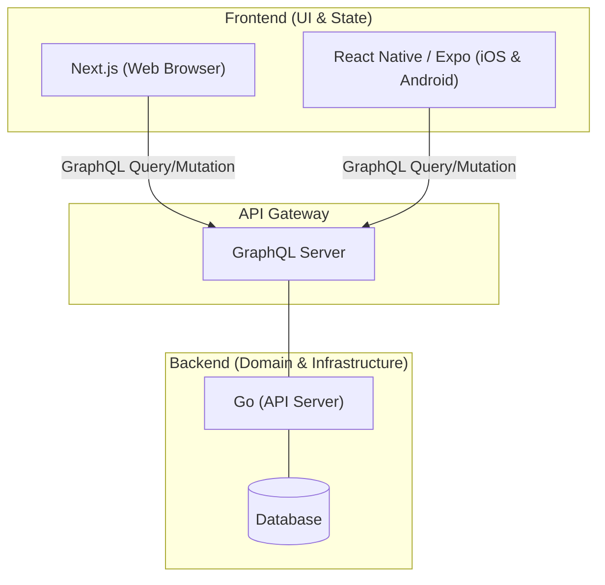

# 08 - マルチクライアントとバックエンド分離戦略 (Multi-Client & Backend Separation)

本ドキュメントでは、Next.js (Server Actions) を中心としたフルスタック構成から、将来的にスマホアプリ（iOS/Android）などのマルチクライアント展開を見据えた際の、アーキテクチャの限界と最適な移行戦略について定義する。

## 1. 現在の構成（Next.js + Server Actions）でスマホアプリ化は可能か？

現在のアーキテクチャのままでも、スマホアプリ化するアプローチはいくつか存在するが、それぞれにトレードオフがある。

| アプローチ | 手法 | メリット | デメリット |
| :--- | :--- | :--- | :--- |
| **WebView / PWA** | Next.jsで作ったWebサイトを、iOS/Androidのネイティブ側でガワ（WebView）だけ作って読み込む。 | バックエンドの改修が一切不要。Webの更新が即アプリに反映される。 | ネイティブ特有の滑らかなアニメーションやUXは得られない。「ただのWebサイト」感が強い。 |
| **Route Handlers (REST API) の追加** | Next.js 内の `app/api/.../route.ts` を作成し、React Native 等から叩ける REST API を後付けする。 | 既存のインフラ（Vercel/DB）やドメインロジック（UseCase）をそのまま流用できる。 | Server Actions と REST API の「2つの入り口」を管理・保守する二度手間が発生する。 |

**【結論】**
Server Actions は Next.js Web専用の隠蔽された通信プロトコルであるため、React Native などの純粋なネイティブアプリから直接呼び出すことはできない。もし現在の Next.js を維持したままネイティブアプリを本気で作るなら、**「API Routes を生やして Next.js をAPIサーバーとして振る舞わせる」** のが現実解となる。

---

## 2. スマホアプリ展開を見据えた「最適構成」とは？

本格的に「Web（Next.js）」と「Mobile（React Native 等）」の両方を展開する場合、ロジックをバックエンド側に完全に切り出し、フロントエンドは「ただのUI」に徹するアーキテクチャが最もスケーラブル（拡張性が高い）となる。

### 最適解: 独立したAPIサーバー（Go）＋ GraphQL

#### なぜこの構成が最適なのか？
1. **フロントエンドの完全な独立 (Headless 化)**
   - Next.js も React Native も、バックエンドの複雑なドメインルールを知る必要がなくなる。APIからデータを貰って描画するだけの「純粋なUI」に専念できる。
2. **GraphQL によるクライアント主導のデータ取得**
   - スマホ画面はWeb画面より狭いため、「PC版と同じAPIを叩くとデータ量が多すぎて重い（オーバーフェッチ）」という問題が起きやすい。GraphQLを使えば、スマホアプリは**「スマホ画面に必要なデータだけ」**をピンポイントで要求でき、通信量とパフォーマンスを最適化できる。
3. **Go 言語による堅牢性と並行処理**
   - バックエンドが独立することで、将来的なプッシュ通知の大量配信、リアルタイムチャットのソケット通信など、Node.js が苦手な処理を Go の得意な `goroutine` に任せることができる。

## 3. 今後の展開（Phase 7 の方針）

上記のマルチクライアント構想を検証するため、次フェーズ（Phase 7）では現在の TypeScript (Next.js) 内に同居しているドメインロジックを切り離し、**「Go言語によるバックエンド再実装 ＋ GraphQL連携」** を行う。
これにより、将来 React Native アプリを追加する際に、一切バックエンドを変更せずに接続できる理想的なAPI基盤が完成する。
