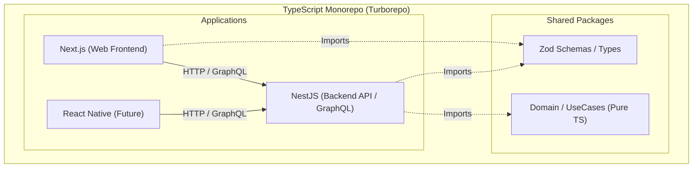

# 08 - マルチクライアントとバックエンド分離戦略 (Multi-Client & Backend Separation)

本ドキュメントでは、Next.js (Server Actions) を中心としたフルスタック構成から、将来的にスマホアプリ（iOS/Android）などのマルチクライアント展開を見据えた際の、アーキテクチャの限界と最適な移行戦略について定義する。

## 1. 現在の構成（Next.js + Server Actions）でスマホアプリ化は可能か？

現在のアーキテクチャのままでも、スマホアプリ化するアプローチはいくつか存在するが、それぞれにトレードオフがある。

| アプローチ | 手法 | メリット | デメリット |
| :--- | :--- | :--- | :--- |
| **WebView / PWA** | Next.jsで作ったWebサイトを、iOS/Androidのネイティブ側でガワ（WebView）だけ作って読み込む。 | バックエンドの改修が一切不要。Webの更新が即アプリに反映される。 | ネイティブ特有の滑らかなアニメーションやUXは得られない。「ただのWebサイト」感が強い。 |
| **Route Handlers (REST API) の追加** | Next.js 内の `app/api/.../route.ts` を作成し、React Native 等から叩ける REST API を後付けする。 | 既存のインフラ（Vercel/DB）やドメインロジック（UseCase）をそのまま流用できる。 | Server Actions と REST API の「2つの入り口」を管理・保守する二度手間が発生する。 |

**【結論】**
Server Actions は Next.js Web専用の隠蔽された通信プロトコルであるため、React Native などの純粋なネイティブアプリから直接呼び出すことはできない。もし現在の Next.js を維持したままネイティブアプリを本気で作るなら、**「API Routes を生やして Next.js をAPIサーバーとして振る舞わせる」** のが現実解となる。

---

## 2. スマホアプリ展開を見据えた「最適構成」とは？

本格的に「Web（Next.js）」と「Mobile（React Native 等）」の両方を展開する場合、ロジックをバックエンド側に完全に切り出し、フロントエンドは「ただのUI」に徹するアーキテクチャが最もスケーラブル（拡張性が高い）となる。

### 最適解: 独立したAPIサーバー（NestJS）＋ モノレポ構成

本プロジェクト（ai-note-market）においては、これまで構築した強固な TypeScript ドメイン資産を無駄にせず最速でAPI分離を果たすため、**「NestJS によるバックエンド分離 ＋ Turborepo等によるモノレポ構成」** を採用する。
（※圧倒的なパフォーマンスが要求されるGo言語での構築は、既存コードの翻訳ではなく、全く新しい別プロジェクトにてゼロから設計・構築することとする）

```mermaid
flowchart TD
    subgraph Monorepo["TypeScript Monorepo (Turborepo)"]
        subgraph Packages["Shared Packages"]
            Domain["Domain / UseCases (Pure TS)"]
            Schemas["Zod Schemas / Types"]
        end

        subgraph Apps["Applications"]
            Web["Next.js (Web Frontend)"]
            Mobile["React Native (Future)"]
            API["NestJS (Backend API / GraphQL)"]
        end

        Web -->|HTTP / GraphQL| API
        Mobile -->|HTTP / GraphQL| API
        API -.->|Imports| Domain
        API -.->|Imports| Schemas
        Web -.->|Imports| Schemas
    end
```

#### なぜこの構成が本プロジェクトの最適解なのか？
1. **既存ドメイン資産の完全流用**: Phase 1〜4 で作成したピュアTSのコード群や85件以上のテストコードを1行も無駄にせず、そのままバックエンドに移行できる。
2. **型の完全共有 (End-to-End Type Safety)**: モノレポにすることで、バックエンド（NestJS）のAPIの型やZodスキーマをフロントエンド（Next.js）と直接共有でき、変更時のコンパイルエラー検知が完璧になる。
3. **フロントエンドの完全な独立 (Headless 化)**: Next.js はバックエンドの複雑なドメインルールを知る必要がなくなり、純粋なUIに専念できる。

## 3. 今後の展開（Phase 7 の方針）

次フェーズ（Phase 7）では、現在の Next.js フルスタック構成からドメインロジックを切り離し、**「NestJSによるバックエンドAPI化 ＋ モノレポ（型の共有）」** を行う。
