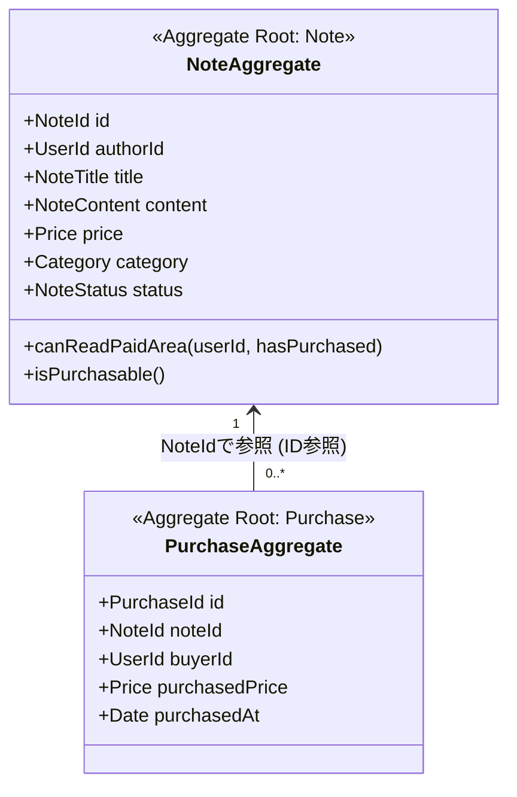

# AI-Note Market ドメインモデル全体マップ (Domain Overview)

- **カテゴリ**: ドメインモデル仕様 (`docs/02-domain-models/`)
- **テーマ**: AI-Note Market の集約構成、集約間リレーション、ユビキタス言語定義

---

## 1. 集約マップと関連図

本システムは、高い並行性能と保守性を維持するため、以下の**2つの主要集約**に分割してモデリングされています。

> **集約間参照の原則**:
> `Purchase` 集約は `Note` 集約のインスタンスを直接保持せず、**`NoteId`（ID値）による疎結合な参照** を行います。これにより、集約ごとの独立した永続化とスケーラビリティを担保します。

---

## 2. 各ドキュメントへのリンク

- [ユビキタス言語定義書 (ubiquitous-language.md)](ubiquitous-language.md)
  - ドメインの公式用語集、コード対応表、禁止用語集（アンチパターン）
- [記事集約仕様書 (01-note-aggregate.md)](01-note-aggregate.md)
  - 構成部品: `NoteTitle`, `NoteContent`（無料/有料エリア分離）, `Price`, `Category`（大カテゴリ×小カテゴリ）, `NoteStatus`
  - 主要ルール: 下書き〜公開〜販売停止の状態遷移、販売停止後の閲覧権限維持
- [購入集約仕様書 (02-purchase-aggregate.md)](02-purchase-aggregate.md)
  - 構成部品: `PurchaseId`, `buyerId: UserId`, `purchasedPrice: Price`（価格スナップショット）, `purchasedAt`
  - 主要ルール: 自己購入禁止、販売状態検証、取引時点価格の固定保持
