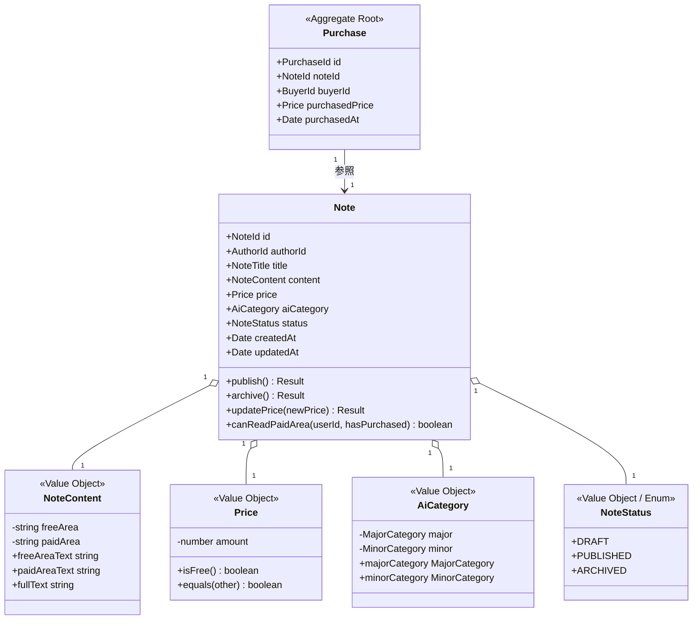

# AI-Note Market ドメインモデル概要・ビジネスルール定義書

- **カテゴリ**: ドメインモデル仕様 (`docs/02-domain-models/`)
- **テーマ**: AI-Note Market における集約・エンティティ・値オブジェクトの定義と不変条件

---

## 1. ドメインモデル概念図

---

## 2. 各値オブジェクト（Value Object）の不変条件（ビジネスルール）

### ① 記事タイトル (`NoteTitle`)
- **文字数制限**: 5文字以上、100文字以内。
- **前後の空白**: 自動トリム（`trim()`）を実施。空白のみは不可。
- **エラーコード**: `INVALID_NOTE_TITLE_LENGTH`

### ② 記事本文 (`NoteContent`)
- **無料エリア (`freeArea`)**:
  - アイディアの概要・前提条件・プレビュー等。
  - 必須（10文字以上、10,000文字以内）。
- **有料エリア (`paidArea`)**:
  - 具体的なコード（Claude Skills定義）、プロンプト全文、設定手順等。
  - 有料記事（Price > 0）の場合は必須（1文字以上、50,000文字以内）。
  - 無料記事（Price = 0）の場合は空文字許容。
- **エラーコード**: `INVALID_FREE_AREA_LENGTH`, `PAID_AREA_REQUIRED_FOR_PAID_NOTE`

### ③ 価格 (`Price`)
- **価格範囲**: 0円（無料）または 100円〜50,000円（有料）。
- **形式**: 整数のみ（小数は不可）。
- **エラーコード**: `INVALID_PRICE_RANGE`

### ④ AIカテゴリ (`AiCategory`)
大カテゴリ（基盤ツール）と小カテゴリ（用途・形式）の組み合わせを厳密に検証する。

| 大カテゴリ (`MajorCategory`) | 許可される小カテゴリ (`MinorCategory`) |
| :--- | :--- |
| **`CLAUDE`** | `SKILLS`, `PROJECTS_ARTIFACTS`, `PROMPT_TEMPLATE` |
| **`GEMINI`** | `SPARK`, `GEMS`, `MULTIMODAL`, `API_INTEGRATION` |
| **`CURSOR`** | `CURSOR_RULES`, `WORKFLOW`, `SYSTEM_PROMPTS` |
| **`CHATGPT`** | `GPTS`, `CUSTOM_INSTRUCTIONS`, `PROMPT_TEMPLATE` |
| **`OTHER`** | `GENERAL_AI`, `AGENT_WORKFLOW` |

- **エラーコード**: `INVALID_AI_CATEGORY_COMBINATION`

---

## 3. 集約・エンティティ（Entity / Aggregate）のビジネスルール

### 記事集約 (`Note`)
1. **状態遷移ルール (`NoteStatus`)**:
   - `DRAFT (下書き)` ➔ `PUBLISHED (公開中)`:
     - タイトル・本文（無料エリア、有料記事なら有料エリア）・価格・カテゴリがすべて正常に設定されていること。
   - `PUBLISHED` ➔ `ARCHIVED (販売停止)`:
     - 著者がいつでも実行可能。
   - `ARCHIVED` ➔ 再公開:
     - ドメインルールに従い再検証。
2. **認可・閲覧判定 (`canReadPaidArea`)**:
   - 記事が「無料（Price = 0）」の場合: 誰でも有料エリア（存在すれば）を閲覧可能。
   - 記事が「有料（Price > 0）」の場合: 「著者本人（`userId === authorId`）」または「購入済みフラグが真」の場合のみ閲覧可能。

### 購入集約 (`Purchase`)
1. **自己購入の禁止**: 著者は自分自身の記事を購入できない（`buyerId !== authorId`）。
2. **二重購入の禁止**: 同一ユーザーによる同一記事の重複購入は不可（UseCase/Repository層で検証）。
3. **購入価格の記録**: 記事の価格が後から改定されても、購入時点の価格（`purchasedPrice`）を保持し続ける。
