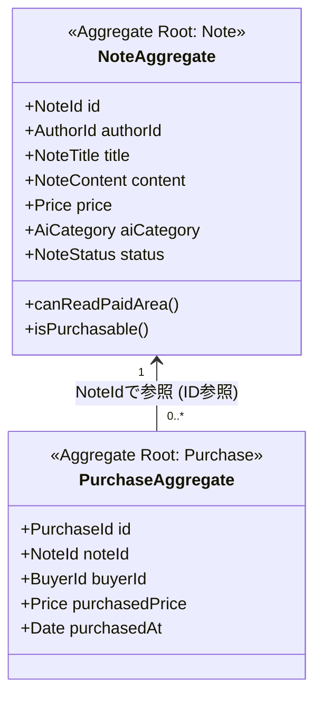

# AI-Note Market ドメインモデル全体マップ (Domain Overview)

- **カテゴリ**: ドメインモデル仕様 (`docs/02-domain-models/`)
- **テーマ**: AI-Note Market の集約構成、集約間リレーション、ユビキタス言語定義

---

## 1. 集約マップと関連図

本システムは、高い並行性能と保守性を維持するため、以下の**2つの主要集約**に分割してモデリングされています。

> **集約間参照の原則**:
> `Purchase` 集約は `Note` 集約のインスタンスを直接保持せず、**`NoteId`（ID値）による疎結合な参照** を行います。これにより、集約ごとの独立した永続化とスケーラビリティを担保します。

---

## 2. 各集約の詳細仕様書へのリンク

- [記事集約仕様書 (01-note-aggregate.md)](01-note-aggregate.md)
  - 構成部品: `NoteTitle`, `NoteContent`（無料/有料エリア分離）, `Price`, `AiCategory`（大カテゴリ×小カテゴリ）, `NoteStatus`
  - 主要ルール: 下書き〜公開〜販売停止の状態遷移、販売停止後の閲覧権限維持
- [購入集約仕様書 (02-purchase-aggregate.md)](02-purchase-aggregate.md)
  - 構成部品: `PurchaseId`, `BuyerId`, `purchasedPrice`（価格スナップショット）, `purchasedAt`
  - 主要ルール: 自己購入禁止、販売状態検証、取引時点価格の固定保持

---

## 3. ユビキタス言語（用語定義集）

| 用語（日本語） | 英語表記 / 型名 | 定義・説明 |
| :--- | :--- | :--- |
| **記事 / ノート** | `Note` | AI活用アイディアやノウハウをまとめたコンテンツ本体（集約ルート）。 |
| **著者** | `AuthorId` | 記事を執筆・公開したユーザーの識別子。 |
| **購入者** | `BuyerId` | 有料記事の購入手続きを行ったユーザーの識別子。 |
| **無料エリア** | `freeArea` | 未購入者を含むすべてのユーザーが閲覧可能な記事の導入・概要部分。 |
| **有料エリア** | `paidArea` | 著者および購入者のみが閲覧可能な具体的なコードやプロンプト本文。 |
| **販売価格** | `Price` (Note側) | 著者が現在設定している記事の販売金額（0円 または 100〜50,000円）。 |
| **購入価格** | `purchasedPrice` (Purchase側) | 取引が成立した瞬間の価格スナップショット（後から改定されても不変）。 |
| **購入記録** | `Purchase` | 記事の購入取引が完了したことを証明する不変の取引証跡（集約ルート）。 |
| **大カテゴリ** | `MajorCategory` | 対象AIの基盤ツール（`CLAUDE`, `GEMINI`, `CURSOR`, `CHATGPT`, `OTHER`）。 |
| **小カテゴリ** | `MinorCategory` | アイディアの形式・用途（`SKILLS`, `SPARK`, `CURSOR_RULES`, `GPTS` 等）。 |
